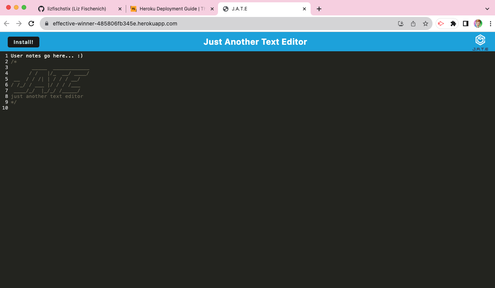

# Liz Makes a Text Editor
  
  ## Description: 
  This project is a progressive web app where the user can enter notes that are saved to a database and recalled whenever the site is reloaded. It can be accessed through the url, and the user also has the option to install the app to their desktop.
  
  

  ## Table of Contents: 
  * [installation](#installation)
  * [credits](#credits)  
  * [contact](#contact)
  * [license](#license)

  ## Installation: 
  If working from the  code repositiry: run "NPM run start" on the root level and open in localhost:3000 once servers are running.  The deployed project can be opened at [effective-winner-485806fb345e.herokuapp.com](https://effective-winner-485806fb345e.herokuapp.com/). From there users can use the app or click install to save it to their devise.
  
  ✅ Check out a demo video → [HERE](https://watch.screencastify.com/v/KzTpAFdmPpd0VAPYShaF) 

  ## Contact:
  🎣 Drop me a line on GitHub: [@lizfischstix](https://github.com/lizfischstix)
  
  ## License:
    This project is licensed under the MIT license